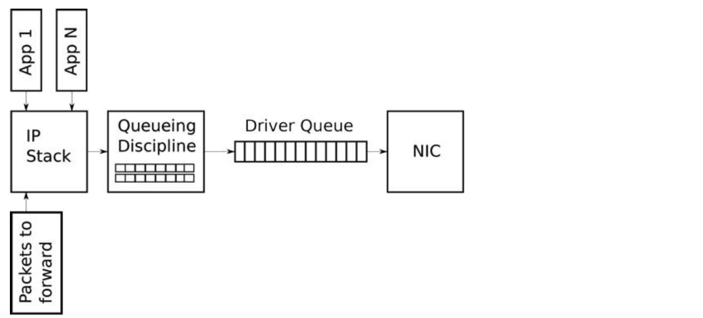
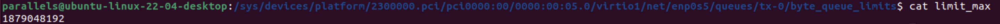
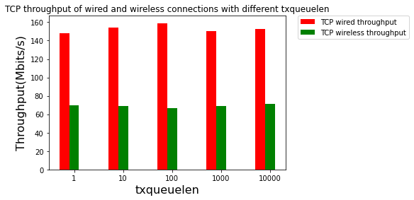
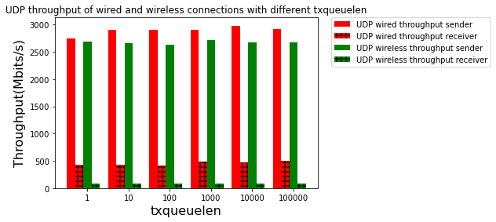
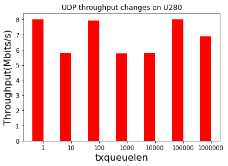
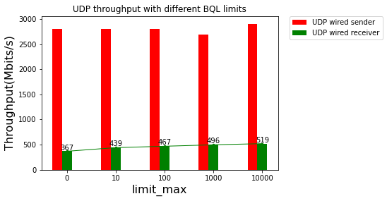
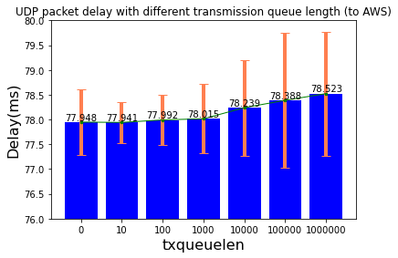
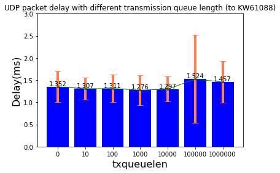
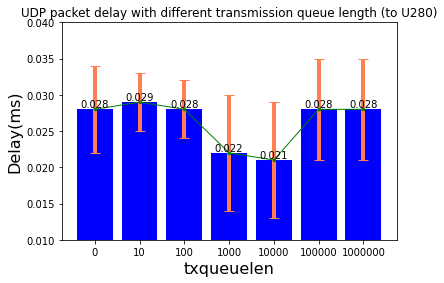

<center><h3>CS244 Assignment 3</h3></center>

<center>Ziyi Yang</center>

<h4>Environment</h4>

* Client-side

I used **Parallels** virtual machine installed on my MacBook Pro with M1 chip for testing. 

| Properties         | Description                                      |
| ------------------ | ------------------------------------------------ |
| Operating System   | Ubuntu 22.04                                     |
| Architecture       | ARM64                                            |
| Wired Interface    | Bridged to the host. The IP is **10.68.203.135** |
| Wireless Interface | Shared network, the IP is **10.211.55.4**        |

* Server-side

For this experiment, I rent an EC2 instance from AWS platform. To make the instance able to be accessed by public, I created a security group which allows all types of inbound and outbound traffic. The EC2 instance configurations are shown as follows.

| Properties       | Description  |
| ---------------- | ------------ |
| Operating System | Ubuntu 22.04 |
| Architecture     | x86_64       |
| Public IP        | 52.56.42.228 |
| Location         | London       |

<h4>Background</h4>

<h5>Queueing in Linux Network Stack </h5>

There are basically two queues we can play with in the Linux network stack. One is **QDisc**, the other one is the **driver queue**. The driver queue is typically implemented as a first-in, first-out (FIFO). The QDisc is the Linux abstraction for traffic queues, which are more complex than the standard FIFO queue. This interface allows the QDisc to carry out complex queue management behaviours without requiring the IP stack or the NIC driver to be modified. The architecture is shown as follows.



In this assignment, we need to see how should transmission queue size be allocated so as to minimize the amount of delay needed to meet certain deadlines. Therefore, the experiment needs to eliminate the uncertainty caused by the driver queue and do some comparisons about throughput and latency for different transmission queue sizes.  

**Byte Queue Limits**

Byte Queue Limits (BQL) is a new feature in recent Linux kernels (> 3.3.0) that attempts to solve the problem of driver queue sizing automatically. This is accomplished by **adding a layer** that **enables and disables queueing** to the driver queue based on calculating the minimum queue size required to avoid starvation under the current system conditions. BQL calculates a **limit of how much data (in bytes) can be queued** at the current time. Any bytes over this limit must be held or dropped by the layers above the driver queue.

Therefore, in this assignment, in order to minimize the influence of the driver queue, the upper limit and lower limit are both set to 0.

<h4>Setup</h4>

1. Set Byte Queue Limits (BQL) to zero

The BQL algorithm is self-tuning. The configuration files are located under /sys directory based on the name of the NIC. For ARM-based machines, the configure files are under 

```c++
/sys/devices/platform/2300000.pci/pci0000:00/0000:00:05.0/virtio1/net/enp0s5/queues/tx-0/byte_queue_limits
```

The hard upper limit on the number of bytes that can be queued can be checked in the **limit_max** file, the default value is 1879048192.

 

I modified the BQL to 0 in order to get rid of the driver queue. 

2. Disable optimizations

   By using the following cmd, all optimizations can be turned off. 

   ```bash
   sudo ethtool -K enp0s5 gso off tso off ufo off gro off sg off
   ```

3. Change the transmission queue length for testing

Using the following cmd, the transmission queue size can be changed. It will change the queue size according to the network interface specified.

```bash
sudo ip link set txqueuelen 500 dev enp0s5
```

<h4>Testing</h4>

<h5>TCP throughput over the wired and wireless channels </h5>

The cmd I used for testing is shown as follows. 

```bash
iperf3 -c 52.56.42.228 -t 30 -b 10G
```

| Connection type | txqueuelen = 1                  | txqueuelen = 10               | txqueuelen = 100                | txqueuelen = 1000                | txqueuelen = 10000               |
| --------------- | ------------------------------- | ----------------------------- | ------------------------------- | -------------------------------- | -------------------------------- |
| Wired           | 148Mbits/s (3.01MBytes CWnd)    | 154Mbits/s (3.02MBytes CWnd)  | 159Mbits/s (3.02MBytes CWnd)    | 150Mbits/s (3.01MBytes CWnd)     | 153Mbits/s (1.59MBytes CWnd)     |
| Wireless        | 69.9 Mbits/s (65.6 kBytes CWnd) | 69.1Mbits/s (65.6kBytes CWnd) | 66.7 Mbits/s (65.6 KBytes CWnd) | 69.1 Mbits/sec (65.6kBytes CWnd) | 71.1 Mbits/sec (65.6KBytes CWnd) |



The TCP throughput does not change much when the transmission queue length grows. The main reason is that **TCP has its own congestion control logic**. 

Cubic TCP variance is used by most Linux kernels. It has a slow start, congestion avoidance, fast retransmit, and fast recovery stages. Before queueing in Qdisc, the TCP congestion control algorithm will highly affect the num of packets to be queued in the Qdisc, which causes the throughput not to change according to txqueuelen. 

<h5>UDP throughput over the wired and wireless channels</h5>

The cmd I used for testing is shown as follows.

```bash
 iperf3 -c 52.56.42.228 -t 30 -b 10G -u -V
```

I set the **target bitrate to 10G** in order to saturate the queue.

| Connection type     | txqueuelen = 1 | txqueuelen = 10 | txqueuelen = 100 | txqueuelen = 1000 | txqueuelen = 10000 | txqueuelen = 100000 |
| ------------------- | -------------- | --------------- | ---------------- | ----------------- | ------------------ | ------------------- |
| Wired (sender)      | 2.74 Gbits/s   | 2.9 Gbits/s     | 2.91 Gbits/s     | 2.90 Gbits/s      | 2.98 Gbits/s       | 2.92Gbits/s         |
| Wired (receiver)    | 435 Mbits/s    | 434 Mbits/s     | 408 Mbits/s      | 488 Mbits/s       | 472 Mbits/s        | 496 Mbits/s         |
| Wireless (sender)   | 2.69 Gbits/s   | 2.66 Gbits/s    | 2.63 Gbits/s     | 2.72 Gbits/s      | 2.68 Gbits/s       | 2.67 Gbits/s        |
| Wireless (receiver) | 85.8 Mbits/s   | 81.0 Mbits/s    | 86.6 Mbits/s     | 84.7 Mbits/s      | 88.3 Mbits/s       | 87.4 Mbits/s        |



UDP has a much simpler transport logic than TCP. It has no congestion control logic. Basically, it "shouts" to the receiver and does not care about the order or lost. This characteristic makes UDP more suitable for testing the throughput. 

However, in this experiment, the result is not that clear. The throughput does not change much with the growth of txqueuelen. 

The main problem here is BQL(Byte Queue Limits). BQL sets limits on how much data can be queued at the current time. It holds and drops bytes that exceed the limit above the driver queue. This will highly affect the result. 

**UDP throughput changes on U280**

The cmd I used for testing is shown as follows. 

```bash
iperf -c 10.72.138.18 -t 30 -b 100G -u
```

| Connection type   | txqueuelen = 1 | txqueuelen = 10 | txqueuelen = 100 | txqueuelen = 1000 | txqueuelen = 10000 | txqueuelen = 100000 | txqueuelen = 1000000 |
| ----------------- | -------------- | --------------- | ---------------- | ----------------- | ------------------ | ------------------- | -------------------- |
| 100Gbps DAC cable | 8.00 Gbits/sec | 5.78Gbits/sec   | 7.92Gbits/sec    | 5.77Gbits/s       | 5.80Gbits/s        | 8.01Gbit/s          | 6.88Gbits/s          |




<h5>Throughput changes adjusting BQL</h5>

From the above experiments, we can see that the Qdisc queue length does not greatly affect the throughput. I tried to change BQL and see the throughput changes in this part. Moreover, UDP is selected to get rid of TCP congestion control logic.

The tx queue length is set to 100. The connection type is wired. Limit_min is fixed. I adjust the driver queue size by adjusting the upper bound (limit_max) 

The cmd used is 

```bash
iperf3 -c 52.56.42.228 -t 30 -b 100G -u -V
```

| send/receiver | limit_max = 0 | limit_max=10 | limit_max=100 | limit_max=1000 | limit_max =10000 |
| ------------- | ------------- | ------------ | ------------- | -------------- | ---------------- |
| Sender        | 2.81 Gbits/s  | 2.80 Gbits/s | 2.80 Gbits/s  | 2.69 Gbits/s   | 2.91 Gbits/s     |
| Receiver      | 376Gbits/s    | 439 Mbits/s  | 467Mbits/s    | 496 Mbits/s    | 519 Mbits/s      |



From the above result, we can see that the sending bitrate of UDP does not vary too much for different queue sizes since the target bitrate is the same. However, the receiver bitrate increases with the queue size. It makes sense since Byte queue limits are a mechanism to limit the size of the transmit hardware queue on a NIC by the number of bytes. If we set the limit low, the packets will be transmitted without sacrificing throughput. If we set the limit high, the packets will full-fill the capacity. 

<h5> Packet delay while manipulating the queue size in Linux</h5>

I used ping cmd to test the delay change according to queue size.

```bash
ping -c 30 serverAddr
```

**From local to AWS EC2 instance**

| txqueuelen | min (ms) | avg(ms) | max(ms) | dev(ms) |
| ---------- | -------- | ------- | ------- | ------- |
| 0          | 77.238   | 77.948  | 80.739  | 0.655   |
| 10         | 77.348   | 77.941  | 79.229  | 0.413   |
| 100        | 77.353   | 77.992  | 79.113  | 0.501   |
| 1000       | 77.286   | 78.015  | 80.958  | 0.697   |
| 10000      | 77.538   | 78.239  | 81.907  | 0.966   |
| 100000     | 77.433   | 78.388  | 84.785  | 1.353   |
| 1000000    | 77.553   | 78.523  | 82.149  | 1.252   |



From the above figure, we can see that the delay increases with the txqueuelen. When txqueulen is small, the NIC driver wakes to pull packets off of the queue for transmission and the queue is empty, the hardware will miss a transmission opportunity, thereby reducing the throughput of the system. This is referred to as **starvation**. However,  this will cause **overflows that drop packets**. When txqueuelen is large,  the NIC driver will be full filled and the packet needs to wait for tranmission. This will increase **latency**.  The txqueuelen gives the best performance should be the one fitting the network connection and NIC device. 

This experiment is done from my local laptop to a private AWS ec2 server in London. The network in between is considerable weak because of the long distance. The txqueuelen generates the lowest latency is **10**. 

**From local to kw61088 (2 hops)**

| txqueuelen | min (ms) | avg(ms) | max(ms) | dev(ms) |
| ---------- | -------- | ------- | ------- | ------- |
| 0          | 0.821    | 1.352   | 2.087   | 0.353   |
| 10         | 0.897    | 1.307   | 2.126   | 0.243   |
| 100        | 0.982    | 1.311   | 2.395   | 0.308   |
| 1000       | 0.824    | 1.276   | 2.521   | 0.334   |
| 10000      | 1.018    | 1.297   | 2.138   | 0.280   |
| 100000     | 0.880    | 1.524   | 6.220   | 0.995   |
| 1000000    | 1.015    | 1.457   | 2.989   | 0.468   |



The same experiment is done with the workstation of our lab. There are only two hops in between. We can see that the txqueuelen generates the lowest delay is **1000**. 

**From NIC to U280(FPGA)**

| txqueuelen | min (ms) | avg(ms) | max(ms) | dev(ms) |
| ---------- | -------- | ------- | ------- | ------- |
| 0          | 0.024    | 0.028   | 0.039   | 0.006   |
| 10         | 0.025    | 0.029   | 0.042   | 0.004   |
| 100        | 0.024    | 0.028   | 0.038   | 0.004   |
| 1000       | 0.017    | 0.022   | 0.056   | 0.008   |
| 10000      | 0.017    | 0.021   | 0.044   | 0.008   |
| 100000     | 0.025    | 0.028   | 0.039   | 0.007   |
| 1000000    | 0.026    | 0.028   | 0.039   | 0.007   |



This experiment is done from the NIC (client) to FPGA board (server) directly. They are connected using a 100Gbits DAC cable and the throughput tested using iperf is around 30Gbits/s. we can see that the txqueuelen generates the lowest delay is **10000**.

<h5>Optimal queue size</h5>

The optimal queue size should be the one fitting the network connection and NIC device the most. 

